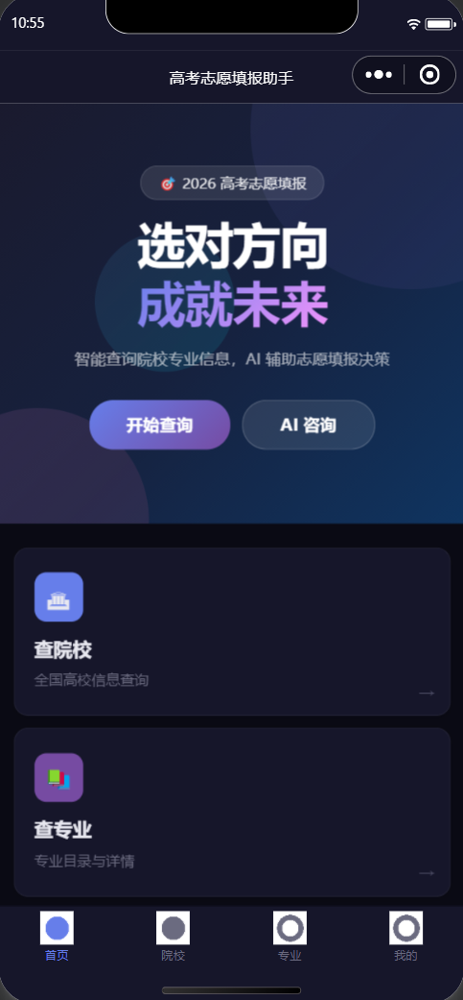

**作者**: [吕某人](https://github.com/lvmou-123)
**邮箱**: 3079490142@qq.com

## 相关项目

| 项目 | 地址 |
|---|---|
| Web 前端 | [lvmou-123/gaokao_school_project-web](https://github.com/lvmou-123/gaokao_school_project-web) |
| 微信小程序端 | [lvmou-123/gaokao_school_project-app](https://github.com/lvmou-123/gaokao_school_project-app) |

<p align="left">
  
</p>

<p align="left">
  
  
</p>

## 技术栈

| 技术 | 用途 |
|---|---|
| Spring Boot 3.2.5 / Java 17 | 应用框架 |
| MySQL 8 / JPA / Redis | 数据存储 |
| JWT | 无状态认证 |
| SpringDoc OpenAPI | API 文档 |
| Zhipu AI (GLM-4.5) | AI 咨询 |
| Maven | 构建 |

## 功能模块

- **认证** — 微信小程序登录、手机号验证码登录/注册、JWT 签发
- **院校** — 院校搜索、详情查询、按专业查院校
- **专业** — 专业搜索、学科门类筛选、详情查询
- **收藏** — 院校收藏、取消收藏、收藏列表
- **志愿** — 志愿填报、优先级排序、状态流转（草稿/提交/录取）
- **推荐** — 按成绩排名生成冲刺/稳妥/保底三个梯度推荐
- **AI 助手** — 基于智谱 GLM-4.5 的志愿填报智能问答
- **用户** — 信息管理、高考成绩录入

## 快速开始

### 环境

JDK 17+, Maven 3.8+, MySQL 8+, Redis 6+

### 配置

```bash
# 创建数据库
mysql -u root -p < sql/init.sql

# 环境变量（或修改 application-dev.yml）
export JWT_SECRET=your-jwt-secret
export WECHAT_APP_ID=your-app-id
export WECHAT_APP_SECRET=your-app-secret
export ZHIPU_API_KEY=your-api-key
```

确保 `application.yml` 中的数据库和 Redis 连接配置正确。

### 运行

```bash
mvn spring-boot:run
# 或打包运行
mvn clean package -DskipTests && java -jar target/gaokao-advisor-0.0.1-SNAPSHOT.jar
```

服务默认监听 `http://localhost:8080`。

### API 文档

启动后访问：

- Swagger UI：[`http://localhost:8080/swagger-ui/index.html`](http://localhost:8080/swagger-ui/index.html)
- OpenAPI：[`http://localhost:8080/v3/api-docs.yaml`](http://localhost:8080/v3/api-docs.yaml)

接口变更后需同步文档：

```bash
mvn springdoc-openapi:generate   # 确保应用运行中
```

提交格式：`feat(api): 变更描述`。

## 认证

除 `/api/auth/**` 和 Swagger 路径外，接口需携带 JWT：

```
Authorization: Bearer <token>
```

Token 有效期 24 小时。

## 数据库

`gaokao_user`、`gaokao_school`、`gaokao_school_tag`、`gaokao_major`、`gaokao_recommendation`、`gaokao_application`、`gaokao_school_favorite`
